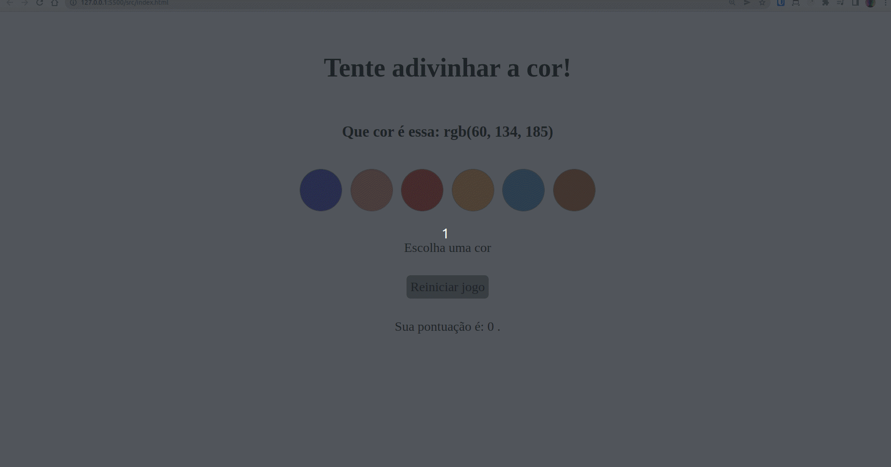

## O que é o projeto Trybe Color Picker: 
Para este projeto, tive que desenvolver um jogo de adivinhar as cores com base no código RGB, utilizando HTML, CSS e Javascript, com o intuíto de aprofundar meus conhecimentos com manipulação do DOM.

A pessoa usuária recebe uma seleção de cores aleatórias e um código RGB, e a partir daí tem que tentar acertar a cor correspondente na tela! 

## Exemplo:

